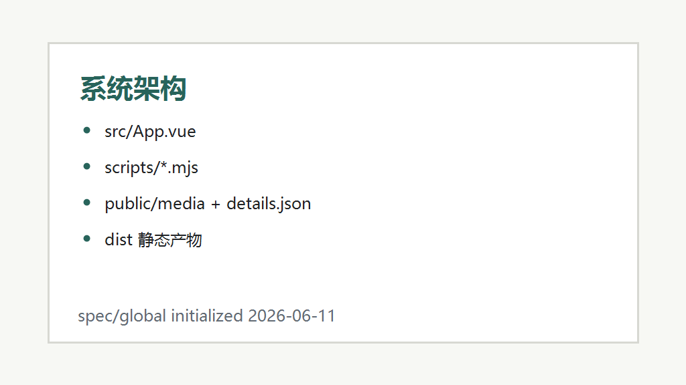
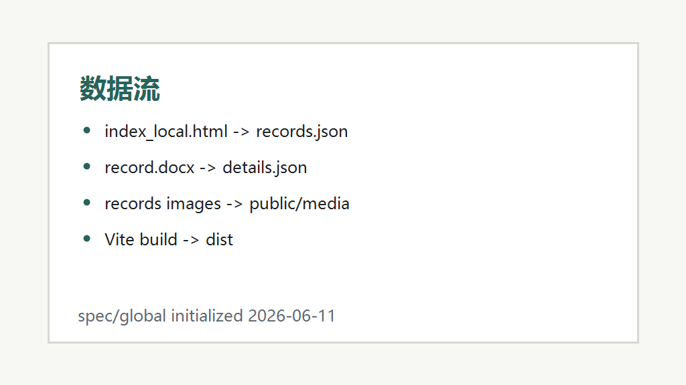

# 架构全景

## 系统组件

- **Vue 3 单页应用:** `src/App.vue` 保留应用 shell，页面由 Vue Router 分发，跨页面运行态由 Pinia store 管理。
- **Element Plus:** 提供按钮、输入框、选择器、表格、轮播、空态和 tooltip 等 UI 组件。
- **数据生成脚本:** `scripts/extract-library-data.mjs` 从 `index_local.html` 同步馆藏 JSON；`scripts/extract-docx-details.mjs` 使用 `mammoth` 把每条 `record.docx` 转为 HTML；`scripts/prepare-public.mjs` 复制 records 静态资源；`scripts/validate-body-parts.mjs` 校验配件阁静态尺寸资料。
- **静态资源目录:** `public/media/` 保存可部署图片与档案副本，`public/details/{detailKey}.html` 保存详情页正文 HTML。
- **部署流水线:** GitHub Actions 在 main/master 推送后构建并上传 `dist/` 到 Pages。

## 模块划分

- **应用入口:** `src/main.js` 初始化 Vue、Pinia、Vue Router、Element Plus 与全局图标。
- **路由层:** `src/router/index.js` 使用 `createWebHashHistory(import.meta.env.BASE_URL)`，固定提供 `overview`、`library`、`index`、`repository`、`body-builder` 等静态站点路由。
- **状态层:** `src/stores/preferences.js` 管理语言与主题；`src/stores/library.js` 管理筛选、详情、图片失败和记录派生数据。
- **页面层:** `src/pages/` 保存页面组件，`src/components/` 保存侧边栏、筛选、卡片、详情、轮播和 `body-builder/` 配件阁组件。
- **样式系统:** `src/styles/index.css` 汇总全局样式，当前继续引入 `src/styles.css` 保持视觉稳定。
- **数据源:** `src/data/records.json` 是运行时打包进 JS 的馆藏索引；`src/data/bodyParts.json`、`src/data/headParts.json` 和 `src/data/part网络数据s.json` 是配件阁静态尺寸资料；`public/details/{detailKey}.html` 是详情页按需 fetch 的静态 HTML。
- **计算工具:** `src/utils/bodyCode.js` 负责组合码解析、默认选择和复制摘要；`src/utils/measurements.js` 负责尺寸汇总、来源脱敏展示和缺失项识别。
- **原始档案:** `records/` 保存原始图片、`record.docx` 和部分 `record.md`。

## 数据流

1. `index_local.html` 内嵌 JSON 经 `extract-library-data.mjs` 生成 `src/data/records.json`。
2. `records/{folder}/record.md` 经 `extract-docx-details.mjs` 生成 `public/details/{detailKey}.html`。
3. `records/{folder}/images` 经 `prepare-public.mjs` 复制到 `public/media/{safeFolder}/`。
4. Vite 构建时把 `public/` 原样复制到 `dist/`，同时把 `src/data/records.json` 打包进应用 JS。
5. 用户点击条目后，`useLibraryStore` 读取 `activeRecord.detailKey`，从 `details/{detailKey}.html` 中取 HTML，经 `sanitizeHtml()` 过滤后由详情页渲染。
6. 用户进入配件阁后，页面读取打包内的 `bodyParts.json`、`headParts.json`、`part网络数据s.json`，在浏览器内完成组合码和尺寸计算。

## 外部集成

- **mammoth:** Node 侧 docx 转 HTML，运行于构建脚本阶段。
- **GitHub Actions:** Node 20 + npm cache + `npm run build`。
- **GitHub Pages:** 静态托管，`BASE_PATH=/angelphilia-library/` 用于资源前缀。

## 部署拓扑

本项目无后端服务、数据库或容器运行时。部署产物为 `dist/` 静态文件，包含 HTML、JS、CSS、`media/` 和 `details/` 等公共资源。

---
*最后更新: 2026-06-18 — 增加配件阁静态资料与计算工具*
