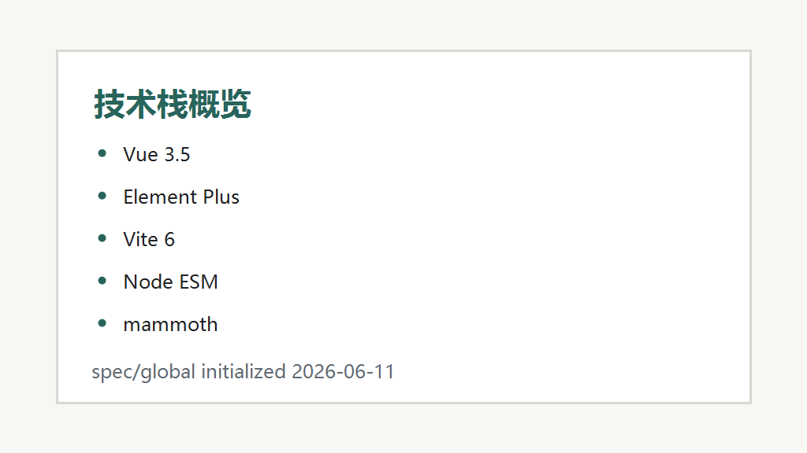

# 项目架构约束

## 技术栈

- **语言:** JavaScript ESM、Vue SFC、CSS。
- **前端框架:** Vue 3.5。
- **路由:** Vue Router 4，使用 hash history 兼容 GitHub Pages。
- **状态管理:** Pinia，仅管理浏览器运行态。
- **UI 库:** Element Plus 2.8。
- **后端框架:** （未检测到）。
- **数据库:** （未检测到）。
- **缓存:** （未检测到）。
- **构建工具:** Vite 6。
- **包管理器:** npm，使用 `package-lock.json` 固定依赖。
- **文档转换:** `scripts/extract-docx-details.mjs` 读取 `record.md` 并生成 `public/details/{detailKey}.html`，当前不再依赖 `mammoth` 解析 `.docx`。

## 架构决策

- **目录结构:** `src/` 放运行时应用，`scripts/` 放构建前数据准备脚本，`records/` 放原始档案，`public/` 放 Vite 会复制的静态资源。
- **分层架构:** 静态站点，无后端 API；数据准备在 Node 脚本阶段完成，浏览器运行时只读取打包 JSON 和 public JSON。
- **状态管理:** `usePreferencesStore` 管理语言/主题，`useLibraryStore` 管理馆藏筛选、详情缓存、active record 和图片失败状态。
- **通信模式:** 浏览器运行时仅通过 `fetch(details/{detailKey}.html)` 读取本地静态文件。

## API 风格

- **风格:** 无后端 API；运行时读取静态 JSON。
- **认证方式:** 无认证。
- **错误处理:** 图片加载失败记录到 `failedImages` 后过滤；详情 JSON 当前应保证在 dev/build 中生成，避免详情页空态误判。

## 编码规范

- **编码:** 所有文件读写显式使用 UTF-8，避免 Windows PowerShell 默认编码导致中文/日文乱码。
- **命名约定:** `records.json` 中条目使用 `safeFolder` 和 `detailKey` 关联 `public/media/` 与 `public/details/{detailKey}.html`。
- **文件组织:** 新增数据生成能力优先放入 `scripts/`，不要把 docx 转换逻辑放到浏览器运行时。
- **资源路径:** 所有运行时图片路径应指向 `media/{safeFolder}/...`，并通过 `assetUrl()` 结合 `import.meta.env.BASE_URL` 生成部署路径。
- **配件阁数据:** `bodyParts.json`、`headParts.json` 和 `partSources.json` 必须保持静态可打包，所有非空尺寸值必须为 number、单位必须为 `cm` 且必须有泛化 `sourceId`。
- **来源脱敏:** 配件阁 UI、JSON、spec 和复制内容不得保存或展示具体来源 URL、平台、作者或截图说明；用户可见来源统一为“网络数据”。`Obitsu` 仅可作为配件体系名称或默认件名称出现。

## 部署方式

- **环境:** GitHub Pages 静态部署。
- **CI/CD:** `.github/workflows/pages.yml` 在 `main` / `master` 推送和手动触发时执行 `npm ci`、`npm run build`、上传 `dist/`。
- **构建前置:** `build` 必须同步馆藏数据、详情 HTML 和 public 静态资源，确保 `dist/details/` 与 `dist/media/` 覆盖所有条目。

## 安全约束

- **内容来源:** 页面展示本地维护的档案内容和外部来源链接；外链使用 `target="_blank"` 时必须保留 `rel="noopener noreferrer"`。
- **HTML 渲染:** 全仓库仅详情页保留一个受控 `v-html` 入口，渲染前必须通过 `sanitizeHtml()` 白名单过滤；仓库说明等普通链接不得通过 HTML 字符串渲染。
- **静态构建:** 不在仓库提交 `dist/`、`public/media/`、`public/records/` 等生成产物。
- **配件阁校验:** 发布前运行 `npm run validate:body-parts`，阻断具体来源文本、缺失 `sourceId`、非 `cm` 单位和 P 型 eye size 误补。

---
*最后更新: 2026-06-18 — 增加配件阁来源脱敏和数据校验约束*
