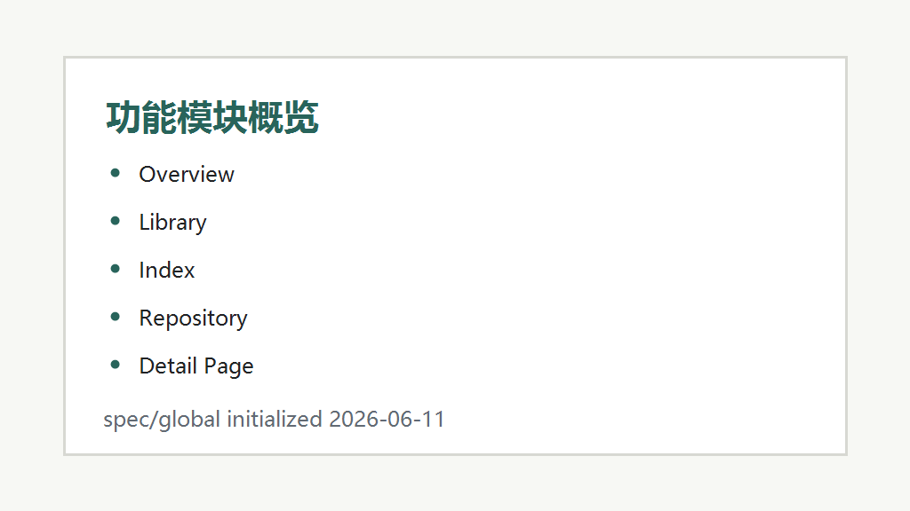

# 已有功能清单

## 馆藏浏览

- **卡片列表:** 按记录展示封面、年份、馆别、名称、标题、系列、肤色、Head、Body。
- **筛选搜索:** 支持关键词、馆别、年份和来源筛选。
- **最近条目:** 侧边栏按年份倒序显示最近 8 条，点击后进入馆藏并聚焦搜索。

## 完整索引

- **表格索引:** 使用 Element Plus 表格展示年份、馆别、编号、名称、版本、Head、Body、肤色和目录。
- **共享筛选条件:** 索引页复用馆藏页的筛选结果，便于核对结构化字段。

## 详情页

- **图片轮播:** 从 `record.safeImages` 或 `safeImageUrl` 读取 `public/media/` 静态图片。
- **docx 正文:** 从 `public/details.json` 按 `detailKey` 读取由 `record.docx` 提取出的 HTML。
- **返回状态:** 进入详情前保存列表滚动位置，返回后恢复。

## 主题与多语言

- **语言切换:** 内置中文、English、日本語三套界面文案。
- **主题切换:** 支持亮色、暗色和跟随系统，设置保存到 `localStorage`。

## 数据与部署

- **馆藏数据同步:** `npm run sync:data` 从 `index_local.html` 生成 `src/data/records.json`。
- **详情数据同步:** `npm run sync:details` 从每个 `record.docx` 生成 `public/details.json`。
- **静态资源准备:** `npm run prepare:public` 复制 records 图片到 `public/media/`。
- **GitHub Pages:** `.github/workflows/pages.yml` 自动构建并发布静态站点。

---
*最后更新: 2026-06-11 — 初始化生成*
