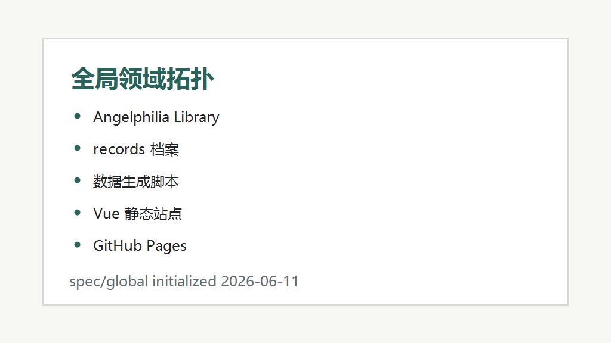

# 项目全局 Spec 索引

## 项目概况

→ [overview.md](./overview.md) — 项目概述

→ [architecture.md](./architecture.md) — 架构全景

→ [features.md](./features.md) — 已有功能清单

→ [constraints.md](./constraints.md) — 架构约束

## 已归档 Feature

| Feature ID | 摘要 | 领域 | 归档日期 |
|-----------|------|------|----------|

## 领域索引

当前尚未拆分独立领域文档。后续若新增采集器、数据清洗、详情页渲染、部署发布等较大功能，可归档到 `spec/global/domains/`。
