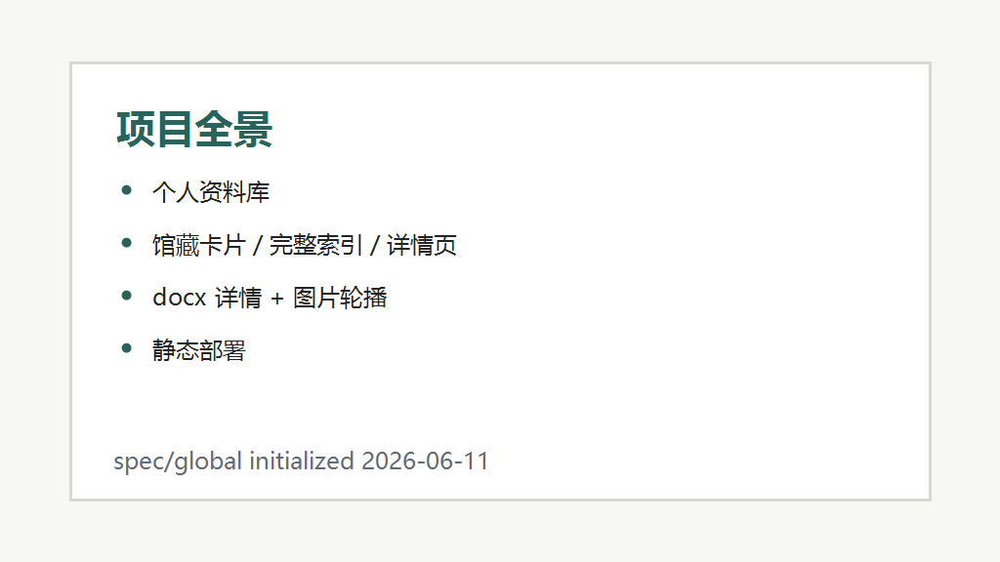

# 项目概述

## 项目目标

`angelphilia-library` 是一个静态前端资料库，用于整理 Angel Philia、Real Art Project / Pink Drops、VMF50 / YAMATO 相关公开档案。项目把本地 `records/` 文件夹下的图片、`record.md`、`record.docx` 和 `index_local.html` 中的结构化条目同步为可部署的 Vue 站点。

## 核心用户

- **资料整理者:** 维护 `records/` 档案、补充 docx 详情、校对年份/系列/肤色/来源字段。
- **浏览用户:** 通过馆藏卡片、完整索引和详情页检索条目，查看图片轮播与 docx 提取出的正文详情。
- **部署维护者:** 通过 GitHub Pages workflow 发布 Vite 构建产物。

## 系统边界

- **本地 records 档案:** 作为图片与 `record.docx` 的源数据，构建时复制到 `public/media/`。
- **`index_local.html`:** 作为馆藏结构化 JSON 的源文件，`scripts/extract-library-data.mjs` 从其中提取 `src/data/records.json`。
- **GitHub Pages:** 通过 `.github/workflows/pages.yml` 执行 `npm ci` 和 `npm run build`，发布 `dist/`。
- **外部官方页面:** 仅作为记录中的引用链接，运行时不依赖实时外部请求。

## 核心业务流程

1. 维护者更新 `records/` 档案或 `index_local.html` 中的条目数据。
2. 构建脚本生成 `src/data/records.json`、复制静态资源并生成 `public/details.json`。
3. Vue 单页应用读取 `records.json` 展示馆藏、索引和详情页；详情页按 `detailKey` 从 `details.json` 取 docx HTML。
4. GitHub Pages 发布 `dist/`，用户通过浏览器访问静态站点。

---
*最后更新: 2026-06-11 — 初始化生成*
